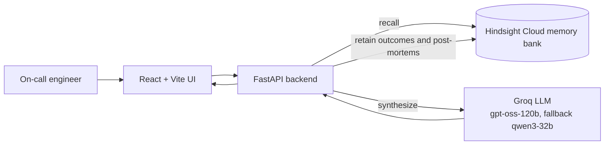

# Recall

**An incident-response agent that remembers how your team fixed outages before, including the fixes that did not work.**

Powered by [Hindsight](https://github.com/vectorize-io/hindsight) (agent memory by Vectorize).

> **Status: under active development.** Sections marked *(planned)* describe the target design and will be updated as features land.

---

## The problem

When production breaks at 3 a.m., the on-call engineer loses time digging through old tickets, chat threads and post-mortems to answer one question: *"Have we seen this before, and what actually fixed it?"* Most tools forget between incidents. Recall does not.

## What Recall does

1. You paste an alert or error log.
2. Recall recalls similar past incidents from long-term memory.
3. It returns a likely root cause, ranked fix steps, and the past incident each suggestion came from.
4. You mark the outcome (fixed / did not work) and add notes.
5. The outcome is stored, so the next suggestion is better. Fixes that failed before are demoted and flagged.

## Key features *(planned)*

- **Memory ON / OFF comparison:** the same alert answered generically and with memory, side by side.
- **Memory panel:** shows what was recalled and why it matched.
- **Learning curve:** measured suggestion quality at interactions 1, 5 and 20, against a memory-off baseline.
- **Post-mortem ingestion:** paste a post-mortem and Recall retains it.
- **Failure-aware ranking:** remembers what did *not* work, not just what did.

## Architecture *(planned)*



## Tech stack

| Layer | Choice |
|---|---|
| Backend | Python, FastAPI, Pydantic |
| Frontend | React (Vite), TypeScript, Tailwind CSS |
| LLM | Groq: `openai/gpt-oss-120b` (fallback `qwen/qwen3-32b`) |
| Memory | Hindsight Cloud via the official `hindsight-client` SDK |

## How Hindsight memory is used *(planned)*

- **`retain`:** every incident, outcome and post-mortem is stored with a descriptive `context`, the real incident `timestamp`, and a stable `document_id` so re-seeding never creates duplicates.
- **`recall`:** each new alert is used as the query; results include facts, experiences and consolidated observations, each traced back to a source incident.
- **Observations:** Hindsight consolidates repeated patterns (for example, "Redis eviction storms follow cache-size changes") into observations that improve over time.
- **Outcome feedback:** "fixed" and "did not work" results are retained, so failed fixes can be demoted next time.

## Getting started

You will need a Hindsight Cloud API key and a Groq API key to run with live services, or you can run completely offline in test mode using `USE_FAKE_MEMORY=true`.

```bash
git clone https://github.com/<your-username>/recall-incident-agent.git
cd recall-incident-agent
cp .env.example .env    # then fill in HINDSIGHT_API_KEY and GROQ_API_KEY
```

### Install dependencies
```bash
pip install -e backend/
```

### Seed Memory Bank
To populate Hindsight memory with 30 synthetic historical incidents and post-mortems:
```bash
python scripts/seed.py
```

### Run Smoke Test
To verify live retain and recall operations on Hindsight Cloud:
```bash
python scripts/smoke_hindsight.py
```

### Start Backend API Server
```bash
uvicorn backend.app.main:app --reload --port 8000
```

### Run Offline Tests
All backend tests pass offline without API keys or network requests:
```bash
PYTHONPATH=. pytest backend/tests
```

## Demo data

All incidents, logs and post-mortems in this repository are **synthetic**, written to look realistic. They do not describe real systems or companies.

## Limitations *(planned)*

- Seed data is synthetic and the learning-curve evaluation is small, so results show the mechanism, not production accuracy.
- Feedback in the evaluation is simulated.
- LLM output varies between runs.

## Acknowledgements

Built on [Hindsight](https://github.com/vectorize-io/hindsight) by [Vectorize](https://vectorize.io). Docs: <https://hindsight.vectorize.io>

## License

MIT
